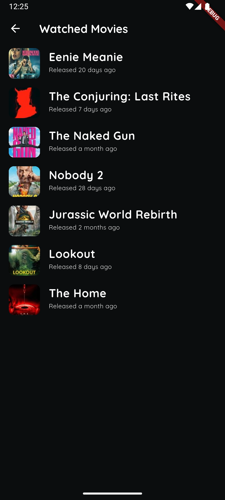

# 🎬 The Movie Buff

Welcome to **The Movie Buff**, your ultimate companion for discovering and managing your favorite
movies!  
This app is designed to provide a seamless and engaging experience for movie enthusiasts.

---

## 🌟 Features

- 🏠 **Home Page**  
  Explore Popular and Now Playing movies at a glance.  
  Stay updated with the latest trends in the movie world.

- 🎥 **Movie Details Page**  
  Dive deeper into any movie with detailed information.  
  View cast, crew, and other essential details.

- ✅ **Mark as Watched**  
  Bookmark movies by marking them as watched.  
  Keep track of all the movies you've seen.

- 📂 **Watched Movies Page**  
  Access a dedicated page to view all your bookmarked movies.  
  Relive your favorite moments anytime.

- 🔍 **Search Page**  
  Find movies effortlessly with a real-time search feature.  
  Implements debouncing to update search results dynamically as you type.

- 📱 **Mocked App Links**  
  Simulate app downloads with mocked links for both Android and iOS platforms.

---

## 🛠 Architecture Overview

The app follows a clean and modular architecture to ensure scalability and maintainability.  
Below is a visual representation of the app's architecture:


---

## 🚀 Get Started

1. **Clone the repository:**
   ```bash
   git clone https://github.com/sbiswas2209/movie-explorer-app.git
   ```

2. **Navigate to the project directory:**
   ```bash
   cd movie-explorer-app
   ```

3. **Install dependencies:**
   ```bash
   flutter pub get
   ```

4. **Run the app:**
   ```bash
   flutter run
   ```

---

## 📸 Screenshots

<p align="center">
  
  
  
  
</p>

---

## 🔧 Technologies Used

- Flutter & Dart
- TMDB API for movie data
- BLoC for state management
- Retrofit for network requests
- sqflite for local storage
